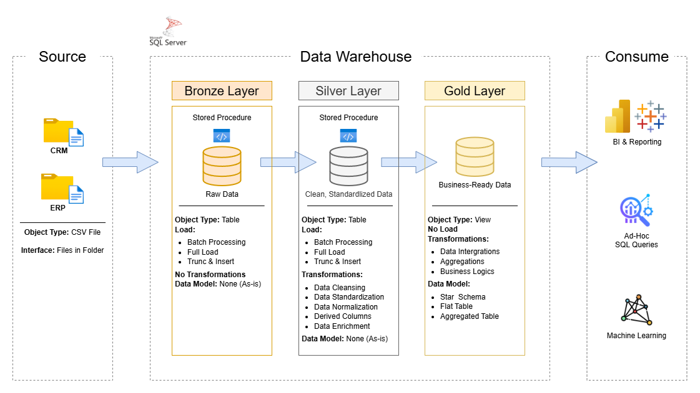

# Data Warehouse and Analytics Project

Welcome to the **Data Warehouse and Analytics Project** repository! 🚀

This project demonstrates a comprehensive data warehousing and analytics solution, from building a data warehouse to generating actionable insights. Designed as a portfolio project highlights industry best practise in data engineering and analytics.

---

## 📖 Project Overview
This project involves:
1. **Data Architecture**: Designing a Modern Data Warehouse using Medallion Architecture **Bronze**, **Silver**, and **Gold** layers.
2. **ETL Pipelines**: Extracting, transforming, and loading data from source systems into the warehouse.
3. **Data Modeling**: Developing fact and dimension tables optimized for analytical queries,
4. **Analytics & Reporting**: Creating SQL-based reports and dashboards for actionable insights.

️🎯 This repository is an excellent resource for professionals and students looking to showcase expertise in:
* SQL Development
* Data Architect
* Data Engineering
* ETL Pipeline Developer
* Data Modeling
* Data Analytics
  
---

## 🛠 Important Tools
* [**Datasets**](datasets): Access to the project dataset (csv files).
* [**SQL Server Express**](https://www-microsoft-com.translate.goog/en-us/download/details.aspx?id=104781&_x_tr_sl=en&_x_tr_tl=vi&_x_tr_hl=vi&_x_tr_pto=tc): Lightweight server for hosting your SQL database,
* [**SQL Server Management Studio (SSMS)**](https://learn.microsoft.com/en-us/ssms/install/install): GUI for managing and interacting with databases.
* [**Git Repository**](https://github.com/): Set up a GitHub account and repository to manage, version, and collaborate on your code efficiently.
* [**DrawIO**](https://www.drawio.com/): Design data architecture, models, flows, and diagrams.
* [**Notion**](https://www.notion.com/vi): All-in-one tool for project management and organization.
* [**Notion Project Steps**](https://app.notion.com/p/Data-Warehouse-Project-36ebbca2aae18098a339f513c374d4ed?source=copy_link): Access to All Project Phases and Tasks.

---

## 🚀 Project Requirements

### Building the Data Warehouse (Data Engineering)

#### Objective
Develop a modern data warehouse using SQL Server to consolidate sales data, enbling analytical reporting and informed decision-making.

#### Specifications
- **Data Sources**: Import data from two source systems (ERP and CRM) provided as CSV file.
- **Data Quality**: Cleanse and resolve data quality issues prior to analysis.
- **Scope**: Focus on the latest dataset only; istorization of data is not required.
- **Documentation**: Provided clear documentation of the data model to support both business stakeholders and analytics teams.

---

### BI: Analytics & Reporting (Data Analytics)

#### Objective
Develop SQL-based analytics to deliver detailed insights into:
- **Customer Behavior**
- **Product Performance**
- **Sales Trends**

These insights empower stakeholders with key business metrics, enabling strategic decision-making.

---

## 🏗 Data Architecture

The data architecture for this project follows Medallion Architecture **Bronze**, **Silver**, and **Gold** layers:



1. **Bronze Layer**: Stores raw data as-is from the source systems. Data is ingested from CSV Files into SQL Server Database
2. **Silver Layer**: This layer includes data cleansing, standardization, and normalization processes to prepare data for analysis.
3. **Gold Layer**: Houses business-ready data modeled into a star schema required for reporting and analytics.

---

## 📁 Repository Structure

```
data-warehouse-project/
│
├── datasets/                      # Raw datasets used for the project (ERP and CRM data)
│
├── docs/                          # Project documentation and architecture details
│   ├── etl.drawio                 # Draw.io file shows all different techniques and methods of E
│   ├── data_architecture.drawio   # Draw.io file shows the project's architecture
│   ├── data_catalog.md            # Catalog of datasets, including field descriptions and metadat
│   ├── data_flow.drawio           # Draw.io file for the data flow diagram
│   ├── data_models.drawio         # Draw.io file for data models (star schema)
│   └── naming-conventions.md      # Consistent naming guidelines for tables, columns, and files
│
├── scripts/                       # SQL scripts for ETL and transformations
│   ├── bronze/                    # Scripts for extracting and loading raw data
│   ├── silver/                    # Scripts for cleaning and transforming data
│   └── gold/                      # Scripts for creating analytical models
│
├── tests/                         # Test scripts and quality files
│
├── README.md                      # Project overview and instructions
├── LICENSE                        # License information for the repository
├── .gitignore                     # Files and directories to be ignored by Git
└── requirements.txt               # Dependencies and requirements for the project
```

---

## 🛡 License

This project is licensed under the [MIT License](LICENSE). You are free to use, modify, and share this project with proper attribution.

## 🌟 About me
